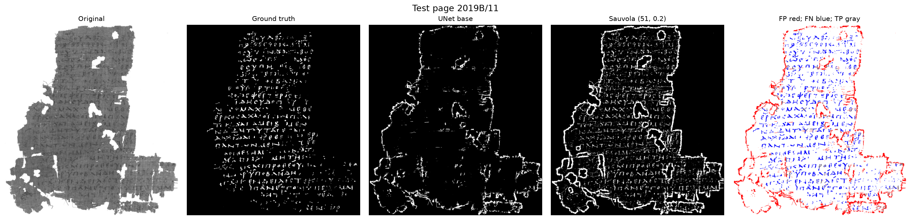
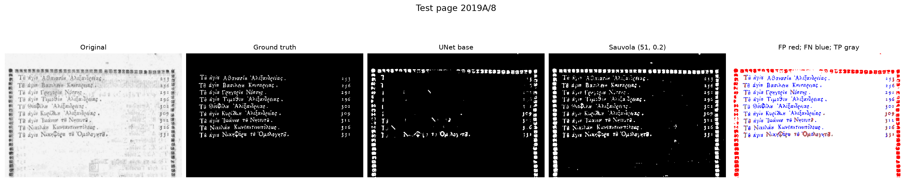
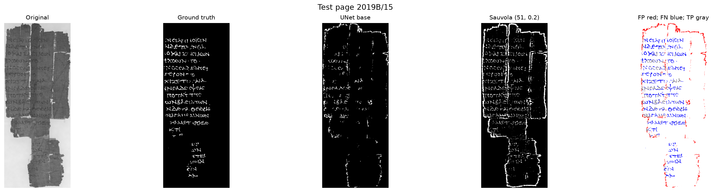
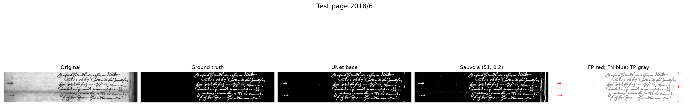

# UNet Binarization of Degraded Historical Manuscripts

## Introduction

Historical document binarization separates foreground writing from paper, stains, and other background marks. This project trains a UNet on DIBCO pages and compares its predictions with conventional thresholding baselines.

TODO: Add project motivation, research question, and citations to DIBCO and prior binarization work.

## Data and split

The manifest contains 136 image/ground-truth pairs across ten available DIBCO years. All listed pairs have matching dimensions; no GT has a dark-pixel fraction above 0.5. 2015 is absent from the available dataset.

| Year | Pages | Split | Notes |
|---|---:|---|---|
| 2009 | 10 | Train | Handwritten and printed |
| 2010 | 10 | Train | Skeleton GT variants excluded |
| 2011 | 16 | Train | 8 handwritten, 8 machine-printed |
| 2012 | 14 | Train | |
| 2013 | 16 | Train | |
| 2014 | 10 | Train | |
| 2016 | 10 | Train | |
| **Train total** | **86** | | |
| 2017 | 20 | Validation | |
| 2018 | 10 | Test | Evaluated once under the fixed protocol below |
| 2019 | 20 | Test | 10 Track A, 10 Track B; evaluated once and reported separately |
| **Test total** | **30** | | |
| **Total** | **136** | | |

The split is frozen in `data/splits.json`: train on 2009–2014 and 2016, validate on 2017, and test on 2018 and 2019. The final test scores are reported below.

### Image dimensions and GT ink fraction

Image dimensions are in pixels. GT ink fraction is the proportion of pixels below grayscale value 128.

| Split | Pages | Height median / min / max | Width median / min / max | Median GT ink fraction |
|---|---:|---:|---:|---:|
| train | 86 | 606 / 259 / 1613 | 1491 / 378 / 4161 | 0.0732 |
| val | 20 | 841.5 / 292 / 2206 | 1311.5 / 351 / 2439 | 0.0933 |
| 2018 | 10 | 605.5 / 286 / 961 | 1729.5 / 1013 / 3933 | 0.0724 |
| 2019A | 10 | 384.5 / 191 / 1094 | 761 / 245 / 1150 | 0.0500 |
| 2019B | 10 | 2395 / 888 / 3465 | 1251 / 832 / 2575 | 0.0825 |

## Methods

The base system is a four-level UNet with batch normalization, RGB input, and base width 16. It trains on random 256×256 patches, with a preference for patches containing ink. Augmentation uses flips, right-angle rotations, brightness/contrast jitter, per-channel gain, and light noise. The loss is an equal-weight combination of binary cross-entropy and Dice loss. Training uses Adam with learning rate 0.001, batch size 16, 1,600 patches per epoch, and a cosine learning-rate schedule for 30 epochs. The best checkpoint is selected by full-page validation F-measure using overlapping-window inference and threshold 0.5.

Ensemble inference averages probability maps from the three base-seed checkpoints. The optional TTA setting averages the original image and horizontal, vertical, and combined flips before thresholding.

TODO: Add implementation and hardware details required by the final report.

## Baselines

| Method | Validation F (%) | Precision (%) | Recall (%) | PSNR (dB) |
|---|---:|---:|---:|---:|
| Otsu | 78.14 | 71.87 | 92.66 | 13.98 |
| Sauvola (window 51, k 0.2) | 82.53 | 83.10 | 84.87 | 15.19 |

Sauvola parameters were selected using training data only. Its 82.53% validation F is the baseline target for the UNet.

## Ablations

### Base run seed variation

| Run | Seed | Best epoch | Best validation F (%) | PSNR at best F (dB) |
|---|---:|---:|---:|---:|
| `unet_base` | 0 | 27 | 91.79 | 18.64 |
| `unet_seed1` | 1 | 17 | 92.37 | 18.88 |
| `unet_seed2` | 2 | 22 | 91.90 | 18.72 |
| **Mean** | | | **92.02** | |

The best-F scores span 0.58 points (sample standard deviation approximately 0.31). The best epoch is selected on this same validation set, so these maxima are optimistic estimates.

### Single-run ablations

| Variant | Change | Best epoch | Best validation F (%) | PSNR at best F (dB) |
|---|---|---:|---:|---:|
| Bleed + low contrast | `--bleed 0.3 --lowcon 0.2` | 16 | 91.12 | 18.17 |
| Grayscale | `--in_ch 1` | 19 | 91.88 | 18.63 |
| BCE only | `--loss bce` | 15 | 92.14 | 18.64 |
| Wider UNet | `--base 32` | 19 | 91.83 | 18.62 |
| Larger patches | `--patch 384 --batch 8` | 15 | 92.12 | 18.75 |

Each ablation was run once. Scores near the three-seed base mean are inconclusive given the observed seed variation; the preselected practical improvement threshold is 92.6% F. The base RGB, BCE+Dice, patch-256, width-16 configuration is retained. The patch-384 run used its recorded patch size at inference.

## Error analysis

Validation page 13 has high recall but low precision across all three base seeds, consistent with show-through being mistaken for foreground ink. The page-13 scores are:

| Run | F (%) | Precision (%) | Recall (%) | PSNR (dB) |
|---|---:|---:|---:|---:|
| `unet_base` | 77.85 | 64.89 | 97.29 | 14.06 |
| `unet_seed1` | 76.99 | 63.82 | 97.01 | 13.86 |
| `unet_seed2` | 78.40 | 65.99 | 96.57 | 14.23 |

The error map uses red for false positives, blue for false negatives, and gray for true positives: `outputs/page13_errors.png`.

Page 17 varies substantially between seeds:

| Run | F (%) | Precision (%) | Recall (%) | PSNR (dB) |
|---|---:|---:|---:|---:|
| `unet_base` (seed 0) | 83.05 | 92.93 | 75.08 | 17.97 |
| `unet_seed1` | 92.70 | 89.49 | 96.15 | 21.03 |
| `unet_seed2` | 85.59 | 94.41 | 78.27 | 18.62 |

The combined bleed/low-contrast augmentation and BCE-only loss improved page 17 in their single runs, but page 13 remained difficult. These page-specific observations do not establish a general improvement.

### Test failure gallery

Figures show the original, GT, saved `unet_base` prediction, Sauvola prediction using the fixed window-51/k=0.2 rule, and an `unet_base` error map (FP red, FN blue, TP gray). Metrics below are copied from the saved per-page CSV; no causes are inferred.

| Page | UNet base F / P / R (%) | Sauvola F / P / R (%) | Figure |
|---|---:|---:|---|
| 2019B/11 | 11.08 / 11.46 / 10.72 | 42.59 / 30.51 / 70.49 | [Figure](../outputs/test_failure_2019B_11.png) |

| 2019A/8 | 16.28 / 15.02 / 17.78 | 50.15 / 36.21 / 81.53 | [Figure](../outputs/test_failure_2019A_8.png) |

| 2019B/15 | 25.92 / 34.98 / 20.59 | 40.60 / 31.63 / 56.70 | [Figure](../outputs/test_failure_2019B_15.png) |

| 2018/6 | 96.73 / 95.13 / 98.38 | 86.68 / 78.22 / 97.18 | [Figure](../outputs/test_failure_2018_6.png) |

TODO: Add an interpretation of the 2019A and 2019B results.

## Evaluation protocol

The frozen test split is `data/splits.json` → `test` (2018, 2019 Track A, and 2019 Track B), and is scored exactly once. The systems specified before evaluation are Otsu; Sauvola with window size 51 and k=0.2; each of `unet_base`, `unet_seed1`, and `unet_seed2` using its saved best checkpoint at threshold 0.5 (reported individually and as the three-seed mean and range); and the three-checkpoint probability ensemble with horizontal/vertical flip TTA, reported as secondary/exploratory. No settings, thresholds, or checkpoints will be changed after observing test results. The validation-selected threshold of 0.5 and base configuration remain fixed.

## Results

The ensemble evaluation used only the 20-page 2017 validation split. Metrics are means over pages; the single-model rows average scores across the three seeds.

| System | F (%) | Precision (%) | Recall (%) | PSNR (dB) | Page 13 F (%) | Page 17 F (%) |
|---|---:|---:|---:|---:|---:|---:|
| Single-model mean | 92.02 | 91.71 | 92.85 | 18.74 | 77.75 | 87.11 |
| Probability ensemble | 92.31 | 92.02 | 93.07 | 18.90 | 77.77 | 88.43 |
| Single-model mean + TTA | 92.29 | 92.09 | 92.99 | 18.91 | 78.07 | 88.59 |
| Ensemble + TTA | 92.48 | 92.24 | 93.18 | 18.99 | 78.08 | 90.16 |

The ensemble adoption rule was fixed in advance at validation F ≥ 92.6%. Ensemble + TTA reached 92.48%, so the decision is **do not adopt the ensemble**; retain the base model configuration. The complete table is saved in `outputs/ensemble_val.csv`.

### Final test-set evaluation

The frozen 30-page test split was evaluated once using the protocol above. Metrics are means of per-page scores within each group. `UNet single-model mean` averages the three saved base-seed runs; its F range is the minimum to maximum of the three seed-level group means. The TTA ensemble is exploratory. Full per-page results are in `outputs/test_per_page.csv`, and grouped results are in `outputs/test_summary.csv`.

| System | Group | F (%) | Precision (%) | Recall (%) | PSNR (dB) | Three-seed F range (%) |
|---|---|---:|---:|---:|---:|---:|
| Otsu | 2018 | 51.45 | 42.50 | 78.85 | 9.79 | — |
| Otsu | 2019A | 72.75 | 65.56 | 92.10 | 15.50 | — |
| Otsu | 2019B | 23.52 | 13.54 | 99.91 | 2.82 | — |
| Otsu | All test pages | 49.24 | 40.53 | 90.29 | 9.37 | — |
| Sauvola (51, 0.2) | 2018 | 64.79 | 63.06 | 75.10 | 13.15 | — |
| Sauvola (51, 0.2) | 2019A | 70.48 | 60.16 | 93.15 | 14.77 | — |
| Sauvola (51, 0.2) | 2019B | 56.10 | 43.67 | 83.85 | 10.10 | — |
| Sauvola (51, 0.2) | All test pages | 63.79 | 55.63 | 84.03 | 12.67 | — |
| `unet_base` | 2018 | 83.64 | 81.24 | 87.77 | 16.84 | — |
| `unet_base` | 2019A | 56.28 | 43.34 | 82.19 | 12.34 | — |
| `unet_base` | 2019B | 56.94 | 55.97 | 61.64 | 12.19 | — |
| `unet_base` | All test pages | 65.62 | 60.18 | 77.20 | 13.79 | — |
| `unet_seed1` | 2018 | 83.42 | 80.93 | 87.53 | 16.92 | — |
| `unet_seed1` | 2019A | 60.99 | 47.34 | 86.67 | 12.83 | — |
| `unet_seed1` | 2019B | 61.30 | 58.48 | 67.72 | 12.43 | — |
| `unet_seed1` | All test pages | 68.57 | 62.25 | 80.64 | 14.06 | — |
| `unet_seed2` | 2018 | 82.61 | 80.01 | 87.33 | 16.63 | — |
| `unet_seed2` | 2019A | 54.07 | 42.46 | 77.41 | 12.26 | — |
| `unet_seed2` | 2019B | 57.98 | 57.92 | 61.31 | 12.22 | — |
| `unet_seed2` | All test pages | 64.88 | 60.13 | 75.35 | 13.71 | — |
| UNet single-model mean | 2018 | 83.22 | 80.73 | 87.54 | 16.80 | 82.61–83.64 |
| UNet single-model mean | 2019A | 57.11 | 44.38 | 82.09 | 12.48 | 54.07–60.99 |
| UNet single-model mean | 2019B | 58.74 | 57.46 | 63.55 | 12.28 | 56.94–61.30 |
| UNet single-model mean | All test pages | 66.36 | 60.86 | 77.73 | 13.85 | 64.88–68.57 |
| Ensemble + TTA (exploratory) | 2018 | 84.31 | 82.76 | 87.45 | 17.11 | — |
| Ensemble + TTA (exploratory) | 2019A | 58.46 | 45.56 | 82.86 | 12.68 | — |
| Ensemble + TTA (exploratory) | 2019B | 59.60 | 58.71 | 63.94 | 12.47 | — |
| Ensemble + TTA (exploratory) | All test pages | 67.46 | 62.34 | 78.08 | 14.09 | — |

## v2 post-hoc test evaluation: predictions made before running

- 2019A: v2 seed-mean F improves by at least 5 points over v1 (57.11).
- 2018: v2 seed-mean F stays within +/-2 points of v1 (83.22).
- 2019B: no prediction (the observed failures looked like an appearance shift rather than a scale shift).
- v2 was designed after seeing test failures, so its test numbers are optimistic and exploratory. v1 remains the primary result.
- Validation facts that motivated this run: v2 seed-mean val F 90.82 vs v1 92.02 at native scale, and v2 beats v1 by 17.1, 10.5 and 9.4 F points at 0.25x, 0.35x and 2x.

### v2 post-hoc test results

The v2 test evaluation was post-hoc and exploratory. It used the fixed test split, overlapping-window inference, threshold 0.5, and no TTA. Metrics are means of per-page scores. Per-page metrics are in `outputs/test_v2_per_page.csv`; grouped metrics are in `outputs/test_v2_summary.csv`. v1 remains the primary result.

| System | Group | F (%) | Precision (%) | Recall (%) | PSNR (dB) |
|---|---|---:|---:|---:|---:|
| v2 seed 0 | 2018 | 83.21 | 76.81 | 91.76 | 16.37 |
| v2 seed 0 | 2019A | 69.24 | 57.03 | 92.24 | 14.37 |
| v2 seed 0 | 2019B | 61.64 | 53.50 | 75.63 | 11.81 |
| v2 seed 0 | All test pages | 71.36 | 62.45 | 86.55 | 14.19 |
| v2 seed 1 | 2018 | 77.83 | 73.75 | 85.25 | 15.19 |
| v2 seed 1 | 2019A | 69.75 | 58.14 | 91.95 | 14.50 |
| v2 seed 1 | 2019B | 61.30 | 50.16 | 81.68 | 11.28 |
| v2 seed 1 | All test pages | 69.63 | 60.68 | 86.29 | 13.66 |
| v2 seed 2 | 2018 | 79.48 | 71.65 | 92.70 | 15.68 |
| v2 seed 2 | 2019A | 70.63 | 58.85 | 91.24 | 14.77 |
| v2 seed 2 | 2019B | 58.33 | 53.67 | 67.77 | 12.01 |
| v2 seed 2 | All test pages | 69.48 | 61.39 | 83.90 | 14.15 |
| v2 seed mean | 2018 | 80.17 | 74.07 | 89.90 | 15.75 |
| v2 seed mean | 2019A | 69.87 | 58.00 | 91.81 | 14.55 |
| v2 seed mean | 2019B | 60.42 | 52.45 | 75.02 | 11.70 |
| v2 seed mean | All test pages | 70.16 | 61.51 | 85.58 | 14.00 |

#### Paired per-page comparison: v2 minus v1 seed mean

Percentile 95% bootstrap confidence intervals use 10,000 resamples of pages with seed 42. Page scores were paired by page identity. Comparisons use saved scores only.

| Group | Pages | v1 seed mean F (%) | v2 seed-mean F (%) | Mean paired F difference (pp) | 95% CI (pp) | v2 beats comparator |
|---|---:|---:|---:|---:|---:|---:|
| 2018 | 10 | 83.22 | 80.17 | -3.05 | [-7.10, 0.20] | 2/10 |
| 2019A | 10 | 57.11 | 69.87 | 12.76 | [7.68, 17.23] | 9/10 |
| 2019B | 10 | 58.74 | 60.42 | 1.68 | [-4.18, 7.26] | 7/10 |
| All test pages | 30 | 66.36 | 70.16 | 3.80 | [0.13, 7.42] | 18/30 |

#### Paired per-page comparison: v2 minus Sauvola

Percentile 95% bootstrap confidence intervals use 10,000 resamples of pages with seed 42. Page scores were paired by page identity. Comparisons use saved scores only.

| Group | Pages | Sauvola F (%) | v2 seed-mean F (%) | Mean paired F difference (pp) | 95% CI (pp) | v2 beats comparator |
|---|---:|---:|---:|---:|---:|---:|
| 2018 | 10 | 64.79 | 80.17 | 15.38 | [6.92, 26.87] | 10/10 |
| 2019A | 10 | 70.48 | 69.87 | -0.61 | [-6.78, 6.16] | 4/10 |
| 2019B | 10 | 56.10 | 60.42 | 4.32 | [-2.50, 11.12] | 7/10 |
| All test pages | 30 | 63.79 | 70.16 | 6.36 | [1.31, 12.04] | 21/30 |

Prediction outcomes, based only on the listed F scores:

- 2019A: held; v2 seed-mean F was 69.87, 12.76 points above v1 (57.11).
- 2018: did not hold; v2 seed-mean F was 80.17, 3.05 points below v1 (83.22), outside +/-2 points.
- 2019B: no prediction; v2 seed-mean F was 60.42.

**Post-hoc scale-augmented model (v2).** Test-failure diagnostics showed 2019A median GT stroke width is about 2 px, approximately 0.35 of the validation median scale and about 4.5 px for training pages. A validation rescaling experiment showed lower v1 F at smaller and larger scales. v2 was trained with random rescaling factors from 0.35 to 1.6. On validation, it improved F by about 17, 10, and 9 points at 0.25x, 0.35x, and 2x, with a 1.20-point lower native-scale seed-mean F (90.82 vs 92.02). In the one-time test evaluation, v2 was 12.76 F points higher on 2019A (95% CI 7.68 to 17.23), near Sauvola, and 3.05 points lower on 2018 (95% CI -7.10 to 0.20); the v2-minus-v1 2019B interval included zero (1.68, 95% CI -4.18 to 7.26). The 2019A prediction held; the 2018 prediction of staying within +/-2 points did not.

The v2 test results are optimistic and exploratory because the augmentation range was chosen after examining test-set GT stroke widths. This was descriptive analysis rather than selection by test scores, but it informed the model design. The intended claim is limited to a scale-augmented model recovering the 2019A deficit when its augmentation range covers that scale; these results do not establish generalization to unseen thin-stroke collections. v1 remains the primary result.

Figure 2. Test F-measure by group for Otsu, Sauvola, v1 seed mean, and v2 seed mean; bars show per-page means and error bars show per-page minimum to maximum. v2 is post-hoc and its test result is optimistic because the augmentation range was informed by test-set stroke widths.

### Paired per-page comparison: UNet seed mean minus Sauvola

The table reports the mean paired F-measure difference in percentage points, percentile 95% bootstrap confidence intervals from 10,000 page resamples (fixed seed 42), and the number of pages where the UNet seed mean exceeded Sauvola.

| Group | Pages | Mean F difference (pp) | 95% CI (pp) | UNet beats Sauvola |
|---|---:|---:|---:|---:|
| 2018 | 10 | 18.43 | [9.71, 30.01] | 10/10 |
| 2019A | 10 | -13.37 | [-20.77, -5.18] | 2/10 |
| 2019B | 10 | 2.64 | [-6.89, 11.66] | 6/10 |
| ALL | 30 | 2.57 | [-4.31, 10.05] | 18/30 |

Overall, the UNet's advantage over Sauvola is not statistically distinguishable from zero (mean +2.57 F, 95% bootstrap CI [-4.31, 10.05]); it is significantly better on 2018 and significantly worse on 2019A.

The three lowest-F test pages for `unet_base` were 2019B/11 (F 11.08), 2019A/8 (F 16.28), and 2019B/15 (F 25.92). The required black-ink-on-white predictions for `unet_base` and the TTA ensemble are saved under `outputs/test_predictions/`. Hashes, timestamp, and command are recorded in `outputs/test_provenance.txt`.

## Scale diagnosis

### Descriptive GT stroke width

Stroke width per page is estimated as twice the median Euclidean distance-transform value on skeleton pixels. Values below summarize the per-page estimates. Test GT was used for descriptive statistics only, not for selection.

| Split | Pages | Median width (px) | Min (px) | Max (px) |
|---|---:|---:|---:|---:|
| train | 86 | 4.47 | 2.83 | 10.77 |
| val | 20 | 5.66 | 4.00 | 10.00 |
| 2018 | 10 | 5.99 | 4.00 | 8.00 |
| 2019A | 10 | 2.00 | 2.00 | 2.83 |
| 2019B | 10 | 5.83 | 4.00 | 14.00 |

### Grayscale appearance statistics

Caption: Each entry summarizes per-page grayscale medians (0-255) for GT ink and non-ink pixels, and per-page contrast calculated as non-ink median minus ink median. Test GT was used for these descriptive statistics only.

| Split | Pages | Ink median / min / max | Non-ink median / min / max | Contrast median / min / max |
|---|---:|---:|---:|---:|
| train | 86 | 97 / 1 / 183 | 206.5 / 108 / 255 | 103 / 32 / 224 |
| val | 20 | 97 / 32 / 205 | 197.5 / 134 / 252 | 99.5 / 45 / 181 |
| 2018 | 10 | 105 / 46 / 161 | 198 / 152 / 209 | 87.5 / 33 / 148 |
| 2019A | 10 | 107.5 / 36 / 166 | 203 / 160 / 243 | 99 / 76 / 168 |
| 2019B | 10 | 67 / 37 / 80 | 129 / 105 / 255 | 62.5 / 30 / 181 |

### Validation scale sensitivity

Images were resized bicubically and GT masks with nearest-neighbor interpolation. Scores are means over the 20 validation pages; UNet F ranges show the minimum and maximum of the three seed-level means. Checkpoints, patch sizes, and threshold 0.5 were unchanged; Sauvola uses window 51 and k=0.2.

| Scale | Method | F (%) | Precision (%) | Recall (%) | PSNR (dB) | Seed F range (%) |
|---:|---|---:|---:|---:|---:|---:|
| 0.50 | unet_base | 83.12 | 75.81 | 93.20 | 14.91 | - |
| 0.50 | unet_seed1 | 84.15 | 75.86 | 95.25 | 15.03 | - |
| 0.50 | unet_seed2 | 82.85 | 77.62 | 90.49 | 15.06 | - |
| 0.50 | UNet single-model mean | 83.37 | 76.43 | 92.98 | 15.00 | 82.85-84.15 |
| 0.50 | Sauvola (window 51, k 0.2) | 80.10 | 76.74 | 87.29 | 14.37 | - |
| 0.75 | unet_base | 89.32 | 85.67 | 93.69 | 17.08 | - |
| 0.75 | unet_seed1 | 89.38 | 85.18 | 94.42 | 17.05 | - |
| 0.75 | unet_seed2 | 89.68 | 86.84 | 93.04 | 17.25 | - |
| 0.75 | UNet single-model mean | 89.46 | 85.90 | 93.72 | 17.13 | 89.32-89.68 |
| 0.75 | Sauvola (window 51, k 0.2) | 81.17 | 79.63 | 85.88 | 14.72 | - |
| 1.00 | unet_base | 91.79 | 91.34 | 92.80 | 18.64 | - |
| 1.00 | unet_seed1 | 92.37 | 91.49 | 93.73 | 18.88 | - |
| 1.00 | unet_seed2 | 91.90 | 92.30 | 92.02 | 18.72 | - |
| 1.00 | UNet single-model mean | 92.02 | 91.71 | 92.85 | 18.74 | 91.79-92.37 |
| 1.00 | Sauvola (window 51, k 0.2) | 82.53 | 83.10 | 84.87 | 15.19 | - |
| 1.50 | unet_base | 85.01 | 91.86 | 81.67 | 16.64 | - |
| 1.50 | unet_seed1 | 88.17 | 92.17 | 85.34 | 17.10 | - |
| 1.50 | unet_seed2 | 85.80 | 92.40 | 82.01 | 16.73 | - |
| 1.50 | UNet single-model mean | 86.33 | 92.14 | 83.00 | 16.82 | 85.01-88.17 |
| 1.50 | Sauvola (window 51, k 0.2) | 80.95 | 85.72 | 79.60 | 14.98 | - |
| 2.00 | unet_base | 69.13 | 94.65 | 62.00 | 14.94 | - |
| 2.00 | unet_seed1 | 80.26 | 94.46 | 73.22 | 15.90 | - |
| 2.00 | unet_seed2 | 73.77 | 94.71 | 65.93 | 15.18 | - |
| 2.00 | UNet single-model mean | 74.39 | 94.60 | 67.05 | 15.34 | 69.13-80.26 |
| 2.00 | Sauvola (window 51, k 0.2) | 79.58 | 87.96 | 75.87 | 14.88 | - |

Figure 1. Validation F-measure by rescale factor for the v1 seed mean, v2 seed mean, and Sauvola. Shaded bands show the minimum and maximum seed-level F-measures.

TODO: Interpret the stroke-width, appearance, and validation scale-sensitivity results.

## Limitations

- Validation contains 20 pages from one year; best-checkpoint selection on that set introduces selection optimism.
- Test groups contain 10 pages each, so paired confidence intervals are wide.
- The v2 rescaling range was selected after inspecting test-set GT stroke widths; its test results are optimistic and exploratory.
- The 2019B failures, associated with appearance differences on papyri, were not addressed by v2.
- Batch size was not recorded for the v2 seed-0 and seed-1 training runs.
- The finite seed range and best-checkpoint selection on validation can make validation estimates look more favorable.
- Ground-truth conventions, including the decorative border on 2019A/8, affect the scores of all methods.
- Each architectural or loss ablation was run with one seed; only the base and v2 configurations have three seeds.
- Pseudo-F-measure and DRD are not included in the current metrics.
- The OCR comparison remains TODO.
- TODO: Add dataset citations and a discussion of generalization beyond these DIBCO pages.
